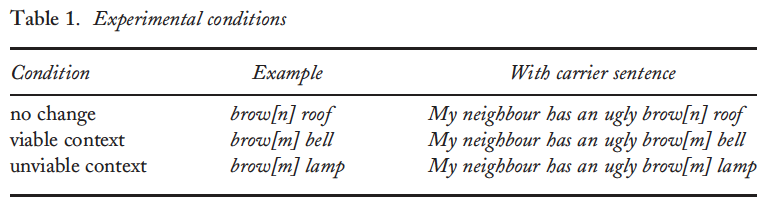

```{r setup, include=FALSE}
options(htmltools.dir.version = FALSE)
```

```{r eval=FALSE, tidy=FALSE,message=FALSE, include=FALSE}
devtools::install_github("yihui/xaringan")
names(xaringan:::list_css())
```

class: left, middle
  
# Do children with dyslexia and/or specific language impairement compensate for place assimilation? Insight into phonological grammar and representation

### (Marshall, Ramus & van der Lely, 2010)

---
class: inverse, center, middle

# Background & Summary

---

# Brief Background

### Dyslexia & Specific Language Impairment (SLI)
- **Dyslexia:** impaired acquisition of literacy skills, with  typical sensory, nonverbal IQ and exposure to written language (Snowling, 2000).

- **SLI:** impairment in language acquisition, with typical sensory and nonverbal IQ (Leonard, 1998).

- There is comorbidity between the disorders due to the posited deficit in underlying phonological representations
- The exact nature of the phonological deficit is unclear. 
---

# Summary

#### Main goal of research
To assess  whether  children  with dyslexia and SLI have a deficit in regards to regressive place assimilation

#### Motivation for research
- Not much research on SLI
- Not much research on children with dyslexia or SLI 
- Not much research on place assimilation related to these disorders 

#### Why place assimilation?
- Place assimilation requires implicit knowledge of phonological representations 
- If place assimilation is impaired, this implies that phonological representations are impaired 
- This would also suggest impairment of phonological grammar in children with dyslexia and SLI

---

class: inverse, center, middle
# Research Questions & Goals

---

# Research Question and Goals
### Main Question
Do English speaking children with dyslexia and SLI have a phonological deficit related to place assimilation?

### Goals
**Goal 1:** Is this phonoloigcal deficit a result of a degraded phonological representation?
**OR** is this deficit a result of an inability to access/manipulated phonological representations?

**Goal 2:** Can the two disorders be distinguished by separate phonological deficits? 

---
# Main Hypothesis 

### Children with dyslexia and/or SLI will not demonstrate regressive place assimilation, if they have degraded phonological representations related to place assimilation. 


---
class: inverse, center, middle

# Methods

---

# Methods 

### Participants
#### 3 Clinical Groups (10 - 15 yrs)
1. SLI + dyslexia: 28 total participants 
2. SLI only: 18 total participants 
3. Dyslexia only: 18 total participants 

#### 3 Matched Control Groups (7 - 14 yrs)
1. LA1 - matched for language/literacy ability of 7 - 8 yrs.
2. LA2 - matched for language/literacy ability of 8 - 10 yrs. 
3. CA - matched for chronological age of SLI + dyslexia

_NOTE: Participants were placed in each group through a series of language tests. Please see link:  for a list of tests criteria for group placement and analyses for comparing groups_ 

---

### Stimuli
1. **Picture-naming task:**
- Words that contained either a word-initial contrast, or a word-final contrast that differed by place, voicing or manner of articulation  

2. **Word-reporting task:**
- **Viable instances:** context is appropriate for assimilation 
  - Noun triggers place assimilation of preceeding adjective
- **Unviable instances:** context is not appropriate for assimilation 
  - Noun cannot trigger assimilation 
- **No change instances:** target surfaces without any change at all



---

### Procedure

**Picture-naming task:** 
- Saw two pictures that only differed by one consonant sound
- Heard two words 
- Had to choose the picture that corresponded to the word they heard
  _Purpose:_ to ensure children can distinguish between phonological minimal      word pairs 
  
**Word-reporting task:**
- Heard the target word first (e.g. adjective)
- Heard a sentence 
- Had to press a button to indicate that they heard the same word presented in isolation as they did in the sentence.

**Critically, participants have to refrain from pressing any button if they did not think that the word in isolate exactly matched the word in the sentence**

---

#Predictions

1. If participants compensate for assimilation: they should report the target word to the same extent in the viable condition as the no-change condition 
2. If participants **do not** compensate: participants will respond in a similar manner in the unviable condition and viable condition. 


Based on work by Darcy et al. (2009), do not predict full compensation
BUT, do suggest that the dyslexia only group should show same pattern as the control groups 

---

class: inverse, center, middle
# Analyses for checking stimuli 
They tested the stimuli on adults before presenting them to children

---
# Analyses for stimuli of word-reporting task 
As this is not the main analysis, I will only briefly touch upon it. They 
checked acoustic compatability of three conditions (viable, unviable and no change) of the word-reporting task:
1. Repeated measures ANOVA by subject 
- Paired samples t-tests to test differences between all conditions  
**Results:** Significant difference between all conditions 

2. One-way ANOVA by item
- Paired sample t-tests to test for differences between all conditions
**Results:** Significant difference between all conditions

---

# Analyses for "control task"
Again, not the main purpose...used an analysis I have not heard of here (see below)

Extracted all target words from carrier phrase and placed adults in forced-choiced task to ensure that differences between viable and unviable conditions was not just a result of having different words 

Used a Wilcoxon signed ranks _t_ test:

**Results:** No difference between viable and unviable; viable approached significance indicating a trend towards viable being pronouned in a more assimilated manner 


**What is a Wilcoxon signed ranks _t_ test?** https://en.wikipedia.org/wiki/Wilcoxon_signed-rank_test
---

class: inverse, center, middle
# Main Analyses

---
# Analysis 1: 3 x 6 ANOVA 

**What:**  3(condition) x 6(group) ANOVA 
- 3 conditions (viable, unviable, and no change)
- 6 groups (SLI + dyslexia, SLI only, dyslexia only, LA1, LA2, CA)

**Why:** 
- To test for overall signficance of experiment 

**Results:** 
- Significant interaction between condition and group 
- Main effect: for both condition and group 

---
# Analysis 1: One-way ANOVAs 

First One-Way ANOVA: to test groups differences within each condition after conduting the 3 x 6 ANOVA

  **Results:** 
  - No effect for no change condition, or viable condition
  - Effect of unviable condition 
  - Post-hoc (Bonferroni): SLI + dyslexia significantly reported target more on unviable than dyslexia only, LA2 and CA; while SLI groups reported unviable more than CA only

Second One-Way ANOVA: to test the factor condition within each group

  **Results:** 
  - Signficance for all groups (control and clinical)

**However:** there were high rates of reporting in the unviable condition... 
And this differed among groups (with SLI + dyslexia reporting more than CA) 
_This suggests that there are biases in word reporting_

---
# Analyses 2: Signal Detection 

**What:** A way to distinguish signal (word-reporting) from noise (response bias)

**How:** Recorded reporting rates into three categories 
1. Hit (baseline): % word reporting in no change condition 
2. Hit (compensation): % word reporting in viable condition 
3. False alarm: % word reporting in unviable condition 

**Computed two _d'_ values**

1. Word-reporting _d'_ = _z_  (baseline hit rate) - _z_ (false-alarm rate)
   Measures overall sensitivity to word-reporting 

2. Compensation _d'_ =  _z_  (compensation hit rate) - _z_  (false-alarm rate)
   Degree of compensation 

3. Calculated overall bias = _z_  (false-alarm rate) 

---
# Why Signal Detection?
To evaluate the significance of compensation effects and compare these effects across groups. Use of one-sample t-tests

**Major Findings:**
1. Word-reporting _d'_ :all groups showed a _d'_  significantly greater than zero for all groups (one-sample t-test)

2. Compensation _d'_ : significantly greater than zero for all groups (one-sample t-test) EXCEPT SLI-only group!
They suggest this is due to a smaller sample size that reduced statistical power

3. Bias = All groups have a negative bias 
   This results a tendency to just respond to the word   
   Bias was signficantly correlated with word-reportding _d'_

---
# Signal Detection (cont'd) 
The authors note that word-compensation is limited by their word-reporting abilities

This results in a new question: Are the differences in compensation _d'_ due to their ability to compensator **OR** due to differences in how groups report words?

**To test this** they conducted the 3x6 ANOVA again, but with word-reporting _d'_ as a covariate. 
- This results in significant effect of word-reporting _d'_ BUT **not** a significant effect of group. 
- They conclude: when word-reporting _d'_ is controlled for, there is no difference among groups in compensation abilites 

---
# Multiple linear step-wise regression #1

**Why**  
To test the hypothesis that: verbal short term memory, metaphonological skills and phonological representations at the word level affect word-reporting rates in the different groups.  


They mention that these are factors that are impaired in dyslexia and SLI 

**How**  
Criterion: Word-reporting _d'_ 
Predictors (all continious): age, the Raven's Profressive Matrices, BPVS  (receptive vocabulary), rhyme awareness, spoonerisms, digit span, picture-word matching  


_NOTE: the descriptions of these tests/ scores can be found in_


---
# Multiple linear step-wise regression #1 (con'd)

**Model Fitting**
- Entered rhyme awareness into model first
- Then vocabulary (BPVS) 
- Then age
- Lastly, picture-word matching 

Entering group did not improve model. Final _R^2_ = 37.9%

**Best Model**
- Vocabulary entered first (greatest contribution to word-reporting _d'_)
- Then rhyme awareness
- Then age 
- Then picture-word matching 

---
# Multiple linear step-wise regression #2   

They reported semi-partial _R_ values.  

- They tested robustness of vocabulary my conduction various regression models with all predictors entered simulataneous _without_ vocabulary  
- Then entered vocabulary last.   


**Semipartial (R > .23) is the complete, most explanatory regression model when vocabulary was added** 

---
# Analysis 4: Multiple linear step-wise regression #3

**How**:  

Criterion: Word-compensation _d'_  
Predictors: same as previous regression

**Findings**:  

There was only significance when word-reporting _d'_ entered the model, which explained 35.1% of the data

They conclude: compensation abilites are limited by word-reporting abilities 

---
# Summing up their conclusions:

1. Children in all three clinical groups can compensate for place assimilation 
2. Differences in magnitude of compensation across groups can be accounted for by differences in word-reporting abilities 
3. Vocabulary level is a primary predictor of word-reporting abilities 

**This suggests:** that perhaps the phonological representations are not degraded, but instead _there are difficulties with access or manipulating these representations._ 

---
# Appropriateness of Analyses 

ANOVA: Generally speaking, one should be cautious with ANOVAs that are larger than 2 x 2 ANOVA as interpretation becomes complicated.  

These authors did not interpret the interaction, or main effects, but instead ended up conducting One-way ANOVAs and post-hocs to determine group/condition differences  

**However:** this quickly got complicated, and they ended up have to use additional tests (i.e. signal detection and regression)

---
# Appropriateness of Analyses (con'd) 
### ANOVA
  
To me this suggests:
- ANOVA may have been a good 'jumping off point' but that it added complexity.  

- However, it revealed biases in word reporting (which end up being very important).  

Overall, the analyses seemed appropriate, but ad-hoc. They did not clearly outline a theoretical motivation.   

---
# Appropriateness of Analyses (con'd)   
**Signal Detection**  
  
This analyses seemed necessary (and thus appropriate) to fully understand the data, because it helped determine why bias in word-reporting occured

**Stepwise Regression # 1**  

It seems like they first did a forward selection (adding variables as they went along). It is unclear why they entered rhyme awareness into the model first.  

**Stepwise regression # 2**  

I am not sure how appropriate it is use to use a _d'_ (specifically that of word reporting) as a criterion in a stepwise regression. This also applies to the above regression.  

**Stepwise regression # 3**  

I understand why they conducted this analysis (to understand if word-reporting influenced word-compensation), but again, I am not sure if it is appropriate to use a _d'_ (i.e. word-compensation) as a criterion. 

---
# Appropriatness of Explanation 
- I believe they explained the original 3x6 ANOVA well, as well as the second 3x6 ANOVA with the covariate or word-reporting _d_

- Additionally, the explanation for the signal detection was fairly clear  

- The only explanation that was potentially unclear was the stepwise regressions, as I mention previously.  

---
# Appropriateness of Interpretation 
**The ANOVA interpretation** was interpretated appropriately, as they did not try to draw conclusions when they found two main effects and an interaction.  

** The signal detection** to my knowledge was interpretated appropriately 

**Stepwise regression** interpretation also seemed appropriate.  

Overall, the interpretation seemed to be accurate in relation to their prediction: that dyslexic only group would perform similar to controls 

---
# Appropriateness of Tables/Graphs
There were many tables and two graphs throughout the article. The tables aided in understanding the different scores on the categorization tests (i.e. how participants were categorized into groups), the _d_ values, the percentage for reporting the target word, and what the materials for the experiment were.

**However**, especially useful was a box plot  which demonstrated the difference  in bias values. 

---
# Appropriateness of Tables/Graphs
**Unfortunately** there was a bar graph; which demonstrated word-reporting _d_ and compensation _d_ for each group. It did not really highlight _why_ SLI only performed poorly on compensation _d_.   

I suggest this because:  

- Just by looking at the graph, word-reporting was highest for dyslexia only; one would anticipate that it would be highest for SLI only

---
# What Analysis would I propose?  
With the design and data they had, it seemed like they did the appropriate analyses. I can see why they did not use a regression. 

However, it may be possible to use a **generalized mixed linear regression** if some alterations could be made. I suggest this because:  

- The study has _continous_ and _categorical_ variables  

- For the continous variables one adjust the dependent measure. I would suggest utilizing one of the measures from the language tasks that they used to categorize individuals (in place of the three conditions)  

- Categorical variables could be dummy coding for the groups (there was theoretical motivation for which group could be used as a reference; as per their prediction)  

- Thus, I would use dyslexia as the reference group

---
# What Analysis would I propose?
**Problems**
- You do not direclty get to compare conditions  

- The word-reporting task (main measure of place assimilation) had three- categorical levels (viable, unviable and no change); thus, binary coding would not work  

**Potential Solution using their given data**
- Use the results from the word-compensation _d_ task as the criterion, and the predictors of condition (dummy coded), and vocabulary  

- This would permit nested model comparisons to see which variables predict compensation

---
# Opinion: What I liked   
- I found the study to be very interesting  

- It is important that understudied cohorts and disorders receive attention

- I do believe that they contributed to the phonological insight of children with Dyslexia and how they may be different from children with SLI in regards to phonological representations  

- I also liked that they were very careful with their classification of each participant into each group

- Overall, it seem as though they took careful planning and execution to obtain the best results possible; working with non-neurotypical populations can be difficult! 

---
# Opinion 
### Areas for improvement   

It left me with the question: _did the experimental conditions truly get at phonological representations?_   

- There were many stats that seemed to feed off of each other in an ad-hoc way. 
Seemed to be more like EDA than hypothesis testing, even though the authors laid out a hypothesis as well as predictions.  

- The task itself seemed difficult; and this difficulty must have impacted performance  

- This is suggested in bias measurements, and discrepencies between word-reporting and word-compensation.  

- The authors however, tried reconcile this task difficulty with additional statistics  

---
# Opinion (con't)   

I do believe that there may not be a degraded phonological representation in dyslexia and SLI, as originally posited; however, I am not as convinced that assimilation processes are fully intact.

I would like to have liked a more clear operational definition in regards to what they meant by phonological representation.

---
# That is all! Thanks :)

